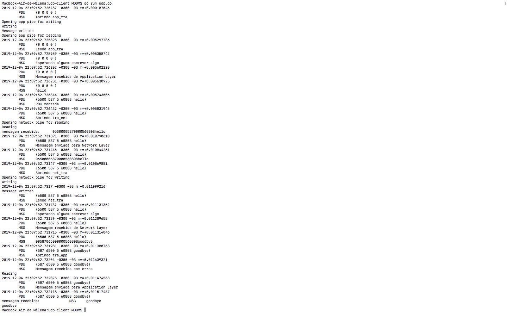
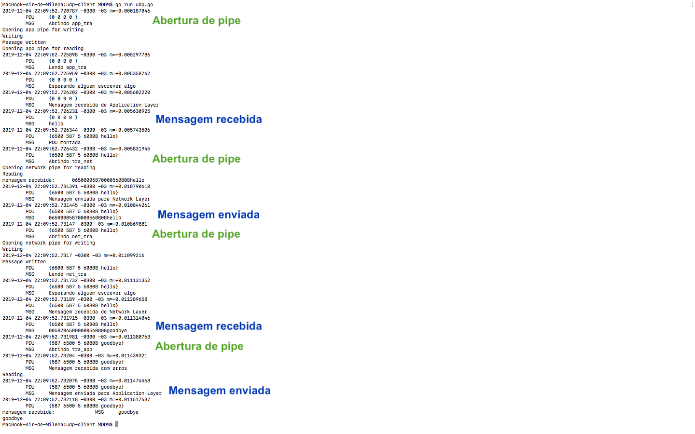
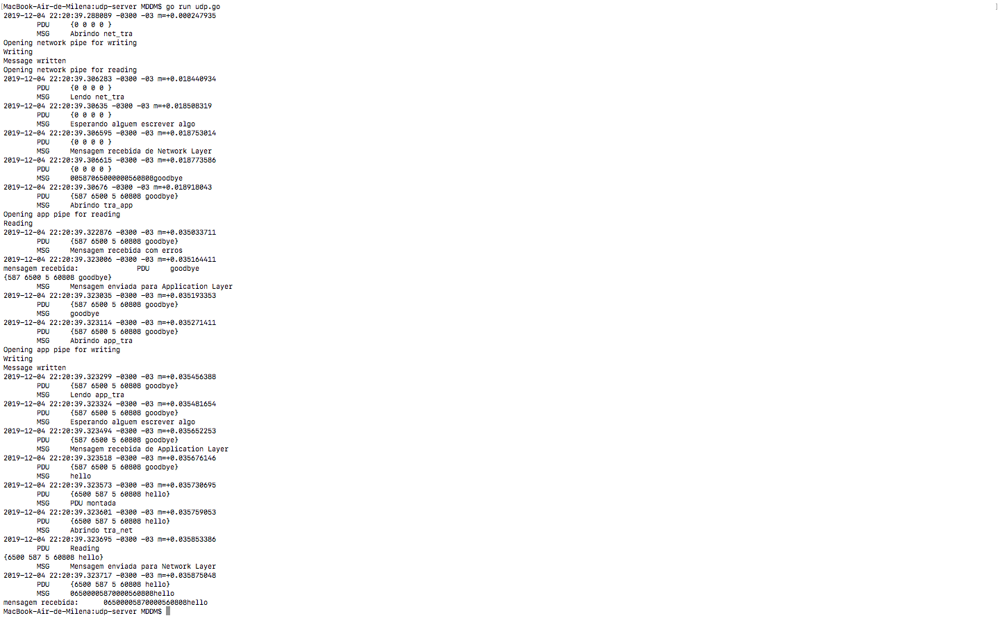

-- Instalação de Go 

	As instruções de acordo com cada sistema operacional estão no site:
	https://golang.org/doc/install

-- Comunicação entre as camadas

	A comunicação entre as camadas é feita por pipes, sendo necessário um para leitura e outro para escrita.
	Assim, cada comunicação entre 2 camadas precisa de 2 pipes.
	Os nomes escolhidos foram no padrão aaa_bbb, sendo aaa a camada de saída da mensagem e bbb a camada de chegada da mensagem.

-- Preparação para a execução

	-- Criação dos pipes
		para cada pasta, é necessário criar os pipes:
		mkfifo app_tra
		mkfifo tra_app
		mkfifo tra_net
		mkfifo net_tra

	-- Para testar se eles foram criados:
		ls -l 

-- Execução

	-- Para rodar o código udp, primeiro, entre na pasta do arquivo udp-client e depois rode:
		go build application.go
		go build network.go
		go run udp.go

	-- Para rodar o código udp, primeiro, entre na pasta do arquivo udp-server e depois rode:
		go build application.go
		go build network.go
		go run udp.go

	-- Para rodar o código tcp-client, primeiro, entre na pasta tcp-client e depois rode:
		go build application.go
		go build network.go
		go run tcp-client.go

	-- Para rodar o código tcp-server, primeiro, entre na pasta tcp-server e depois rode:
		go build application.go
		go build network.go
		go run tcp-server.go

-- Decisões técnicas

	-- PDUs
		As PDUs foram feitas no código de acordo com a especificação.
		Por causa da dificuldade de concatenar numeros em go, foi tomada a decisão de converser as variáveis inteiras para strings para formar a PDU e convertê-las de volta para inteiros quando uma PDU é recebida

	-- Integração
		Não fomos capazes de integrar essa camada com as demais, então, para simular a camada superior e a inferior, cada pasta contém um arquivo application.go e network.go
		Esses arquivos são executados pelo próprio arquivo da camada de transporte (udp ou tcp)

	-- UDP
		No código udp-cliente, há apenas o envio de uma mensagem no protocolo SMTP e o recebimento da resposta (o recebimento da resposta é para mostrar que todas as comunicações entre camadas funcionam).
		Assim, primeiro é lido uma mensagem da camada de Aplicação, a PDU é montada e a PDU+payload são mandados para a camada de Rede. Em seguida, uma mensagem é lida da camada de Rede, a PDU é retirada, o checksum é verificado e o payload é enviado para a camada de Aplicação
		No código udp-server, o mesmo é feito na ordem contrária. Uma mensagem é lida da camada de Rede, a PDU é retirada, o checksum é verificado e o payload é enviado para a camada de Aplicação. Em seguida, uma mensagem da camada de Aplicação é lida, a PDU é montada e a PDU+payload são mandados para a camada de Rede

	-- TCP
		No TCP foi implementado o three-way handshake para o estabelecimento da conexão. Em seguida, no código do cliente, uma mensagem é lida da camada de Aplicação e enviada para a camada de Rede, com os devidos procedimentos realizados. Uma mensagem da camada de Rede é recebida e enviada para a camada de Aplicação com os devidos procedimentos realizados. E, por fim, é realizado o three-way handshake para finalizar a conexão

	-- Log
		Os logs são sempres impressos no terminal, com o time-stamp e a PDU atual

-- Teste
	
	-- Teste de funcionamento do udp-client
	
	

	-- Teste de funcionamento do udp-server
	
